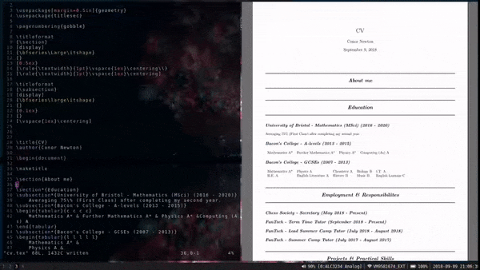

# Vim Latex Previewer




## Dependencies

* vim
* pandoc
    * Evince (Works on Mac)
    * Mupdf
    * Okular

For async support (Compiling in background)

* vim version >= 8.00
* [asyncrun.vim](https://github.com/skywind3000/asyncrun.vim)

## Installation

Just like any other vim plugin

## Usage

### Starting the preview

To start the preview mode:
```
:StartLatexPreview
```
This will compile your latex document and open it in one of the above pdf viewers.

After every save the previewer will be refreshed.

### Choosing a previewer

Stick the following in your vimrc, replacing <previewer> with the name of your preferred pdf viewer.

```
let g:latex_pdf_viewer="<previewer>"
```

### Choosing a latex engine

By default pdflatex will be used. Replace <engine> with your engine of choice i.e xelatex.

```
let g:latex_engine="<engine>"
```
